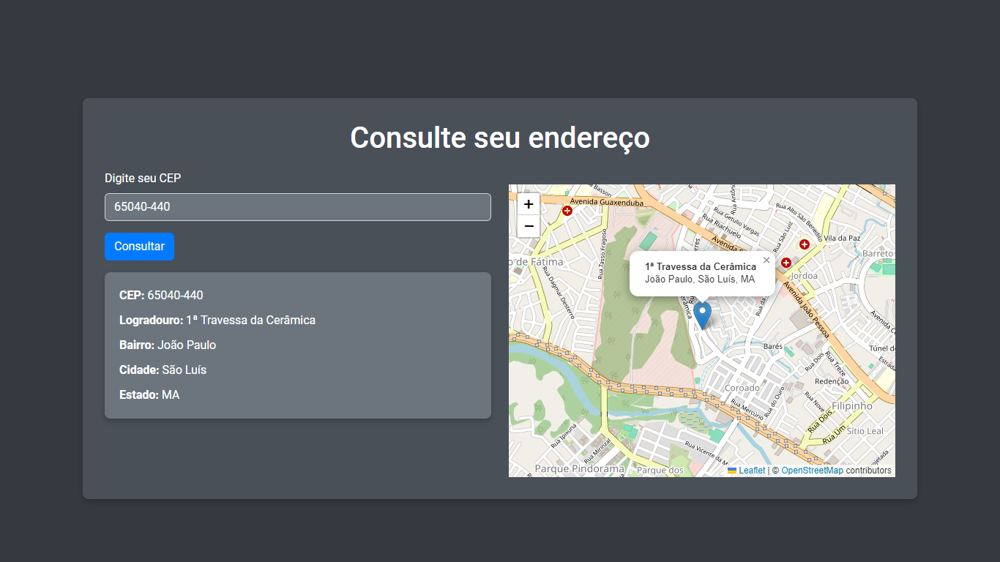

# Buscador de CEP

Este projeto é uma aplicação web simples que permite aos usuários consultar o endereço correspondente a um CEP (Código de Endereçamento Postal) e visualizar a localização em um mapa. A aplicação utiliza a API ViaCEP para buscar as informações do endereço e a biblioteca Leaflet para exibir o mapa.



## Funcionalidades

- Consulta de endereço a partir de um CEP.
- Exibição do endereço consultado.
- Visualização da localização no mapa.

## Tecnologias Utilizadas

- HTML5
- CSS3 (Bootstrap)
- JavaScript
- API ViaCEP

## Estrutura do Projeto

- `index.html`: Arquivo HTML principal contendo a estrutura da página.
- `components/css/styles.css`: Arquivo CSS personalizado para estilizar a página.
- `components/js/script.js`: Arquivo JavaScript contendo a lógica de consulta e exibição do mapa.

## Como Utilizar

1. Faça o download ou clone este repositório.
   ```bash
   git clone https://github.com/seuusuario/buscador-de-cep.git
   ```
2. Navegue até o diretório do projeto.
   ```bash
   cd buscador-de-cep
   ```
3. Certifique-se de que você tem uma conexão com a internet para carregar as dependências do Bootstrap e Leaflet.
4. Abra o arquivo `index.html` em seu navegador.

## Explicação do Código

### HTML (`index.html`)

O arquivo HTML contém a estrutura da página, incluindo os seguintes elementos principais:

- Inclusão de CSS do Bootstrap e da fonte Roboto.
- Um campo de entrada para o usuário digitar o CEP.
- Um botão para iniciar a consulta.
- Uma área para exibir o resultado da consulta.
- Um contêiner para o mapa.

### CSS (`components/css/styles.css`)

O arquivo CSS contém estilos personalizados para a página. Certifique-se de que o caminho para este arquivo está correto no HTML.

### JavaScript (`components/js/script.js`)

O arquivo JavaScript contém a lógica para buscar o endereço e exibir o mapa:

- Captura o evento de clique no botão "Consultar".
- Faz uma requisição à API ViaCEP para obter os dados do endereço.
- Atualiza a área de resultado com as informações do endereço.
- Usa a biblioteca Leaflet para exibir o mapa com a localização correspondente ao CEP.

## Notas

- Certifique-se de que a URL para o CSS e JS personalizados está correta.
- A API ViaCEP não fornece coordenadas (latitude e longitude). Você precisará usar um serviço adicional para converter o endereço em coordenadas geográficas ou modificar a lógica para exibir um mapa genérico.

## Melhorias Futuras

- Melhorar a exibição do mapa com base em coordenadas mais precisas.
- Adicionar tratamento de erros mais robusto.

## Licença

Este projeto é licenciado sob a MIT License. Sinta-se livre para usá-lo e modificá-lo conforme necessário.

---
